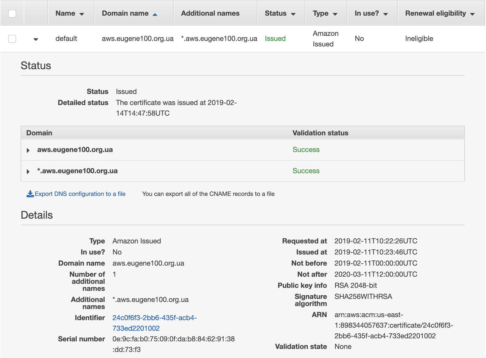

# Eugene100 on AWS

Link on the GitHub page: https://github.com/eugene100/aws-eugene100


Presentation with useful links: [PDF](), [Keynote](https://www.icloud.com/keynote/0L7cA9sSdX8j3S2rgzu8oWolw#AWS_-_Kubernetes_-_Application)

The main zone is **us-east-1**

Tune up AWS account and [AWS CLI](https://docs.aws.amazon.com/cli/latest/userguide/cli-chap-install.html)


## Terraform

All objects with tag `managed=terraform` covered by terraform code.

**tf-state** file located in **eugene100-terraform-tfstate** s3 bucket, create it.


## KOPS

[KOPS Getting Started](https://github.com/kubernetes/kops/blob/master/docs/aws.md)

[kops create cluster](https://github.com/kubernetes/kops/blob/master/docs/cli/kops_create_cluster.md#kops-create-cluster)

```bash
export KOPS_STATE_STORE=s3://eugene100-k8s-state-store
export NAME=aws.eugene100.org.ua
```

```bash
$ kops create cluster \
    --master-volume-size 8 \
    --master-size t2.micro \
    --node-count 1 \
    --node-size t2.micro \
    --node-volume-size 8 \
    --zones us-east-1d,us-east-1a,us-east-1c \
    ${NAME} \
    --out=. \
    --target=terraform
$ kops edit cluster ${NAME}
```

> Hint: Check command line parameters [kops create cluster](https://github.com/kubernetes/kops/blob/master/docs/cli/kops_create_cluster.md#kops-create-cluster)

Waiting while the cluster is risen up:
```bash
$ kops validate cluster ${NAME}
```

Add more nodes to the cluster

```bash
$ kops edit ig nodes
$ kops update cluster aws.eugene100.org.ua --yes
```


## Helm

```bash
$ kubectl -n kube-system create serviceaccount tiller
$ kubectl create clusterrolebinding tiller \
  --clusterrole cluster-admin \
  --serviceaccount=kube-system:tiller
$ helm init --service-account tiller
```


## Ingress

Generate SSL certificate by [AWS console](https://console.aws.amazon.com/acm/home?region=us-east-1#/). 

Go to `charts/` folder in the GitHub repository. Change service annotations according yours settings in `values.yaml`:
```yaml
  service:
    annotations:
      domainName: "aws.eugene100.org.ua"
      service.beta.kubernetes.io/aws-load-balancer-ssl-cert: 	arn:aws:acm:us-east-1:898344057637:certificate/24c0f6f3-2bb6-435f-acb4-733ed2201002
```
Install ingress controller:
```bash
$ helm install --name ingress -f values.yaml .
```
Check ELB is created on [console](https://console.aws.amazon.com/ec2/v2/home?region=us-east-1#LoadBalancers:sort=loadBalancerName).

Create wildcard DNS A record with **alias** point to a loadbalancer DNS name:
```
*.aws.eugene100.org.ua. A ALIAS dualstack.a4ee04d64517511e9b9c60e8670309ac-375430142.us-east-1.elb.amazonaws.com.
```


## Dashboard

Change settings related to your domain in `values.yaml`:

```yaml
  hosts:
    - dashboard.aws.eugene100.org.ua
```

```bash
$ helm install --name dashboard -f values.yaml .
```

> Not working but you can try :)
>
> Create token: `kubectl -n kube-system describe secret $(kubectl -n kube-system get secret | awk '/^deployment-controller-token-/{print $1}') | awk '$1=="token:"{print $2}'
> `

Open in a browser for test: https://dashboard.aws.eugene100.org.ua

Upgrading helm deployment:

```bash
$ helm upgrade dashboard . -f values.yaml
```


## Jenkins

Change settings related to your domain in `values.yaml`:

```yaml
    hosts:
      - jenkins.aws.eugene100.org.ua
```

Get Jenkins password:

```bash
$ printf $(kubectl get secret --namespace default jenkins -o jsonpath="{.data.jenkins-admin-password}" | base64 --decode);echo
```

Jenkins slaves for Kubernetes already setup. You can create job and make a build.

> Note: If your slave doesn't want to start check the slave pod:
>
> ```bash
> $ kubectl get pods
> NAME                                                     READY   STATUS    RESTARTS   AGE
> dashboard-kubernetes-dashboard-78d9b9f5fc-kw5zt          1/1     Running   0          8h
> default-lq5d5                                            0/1     Pending   0          5m
> ingress-nginx-ingress-controller-6844d9ddb-gqmvk         1/1     Running   0          8h
> ingress-nginx-ingress-default-backend-677b99f864-8js22   1/1     Running   0          8h
> jenkins-58d5c7f5fd-fvv5v                                 1/1     Running   0          9m
> $ kubectl describe po default-lq5d5
> Name:               default-lq5d5
> Namespace:          default
> Priority:           0
> PriorityClassName:  <none>
> Node:               <none>
> ...
> Events:
>   Type     Reason            Age                 From               Message
>   ----     ------            ----                ----               -------
>   Warning  FailedScheduling  9s (x8 over 5m34s)  default-scheduler  0/2 nodes are available: 1 Insufficient cpu, 1 node(s) had taints that the pod didn't tolerate.
> ```
>
> So, we should add a node or increase existant.
>


## Advanced

### Route53 mapper

```bash
$ kubectl apply -f https://raw.githubusercontent.com/kubernetes/kops/master/addons/route53-mapper/v1.3.0.yml
$ kubectl patch deploy --namespace kube-system route53-mapper -p '{"spec":{"template":{"spec":{"serviceAccount":"tiller"}}}}'
```

---

Happy Helming!

